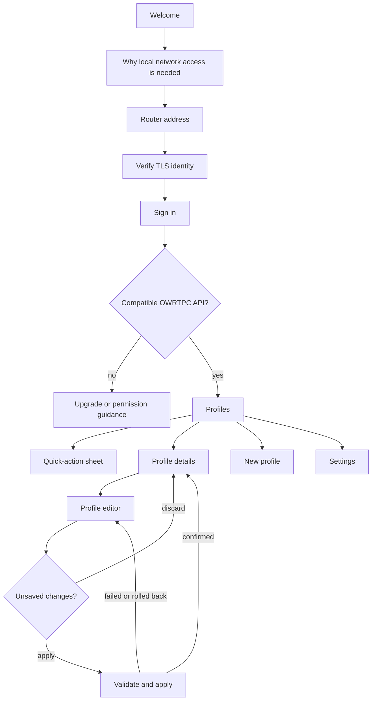

# OWRTPC Mobile: product and technical design

Status: product design active; M0 backend-contract and Flutter platform-spike
implementation started on 2026-08-28.

This document defines the first mobile release and the decisions that must be
validated before production feature work in `owrtpc/mobile`. It is not a
delivery-date commitment.

## Product promise

OWRTPC Mobile is a small, trustworthy companion for a parent who needs to see
the state of their profiles and make a deliberate change without opening LuCI.
It connects directly to one OpenWrt router on the current local network. The
router remains the source of truth for configuration, accounting, quotas and
enforcement.

The first release must be:

- equally usable on Android and iOS;
- useful without an OWRTPC, Apple, Google or vendor cloud account;
- honest about whether a value is live, stale, pending or applied;
- safe around credentials, transport errors and conflicting edits;
- accessible without relying on colour, gestures or perfect vision;
- independent of GL.iNet firmware and optional vendor packages.

LuCI remains a complete independent client. The mobile app neither embeds LuCI
nor duplicates the policy engine.

## V1 scope

### Included

1. Connect to one router by address and authenticated OWRTPC account.
2. Show profile state, today's schedule, used time and remaining time.
3. Run immediate Block/Unblock, Enable/Disable, +1h, +4h and All Day actions.
4. Create, edit, reorder and delete profiles.
5. Assign discovered and offline configured devices to one profile at most.
6. Edit Monday–Thursday / Friday–Sunday allowances and independently grouped
   Sunday–Thursday / Friday–Saturday bedtime windows.
7. Explain connection, permission, session, validation and apply failures.
8. Store secrets only in platform-protected storage when the user opts in.
9. Support localization from the first build. V1 includes English and Italian,
   follows the device language by default and permits a local manual override.
10. Offer one appearance control cycling through Automatic, Light and Dark;
    Automatic follows the current device appearance and is the default.

### Explicitly deferred

- remote access, VPN selection, relay services and cloud accounts;
- notifications, background polling and widgets;
- more than one saved router;
- web filtering, content inspection or changes to the policy algorithm;
- usage history, reports and comparisons across days;
- router setup, package installation, firmware management and firewall edits;
- child-facing views, approval requests and shared-family accounts;
- full OWRTPC data reset from the mobile app.

The full reset API remains available to other authenticated clients, but it is
excluded from V1 because a local-network companion does not yet provide backup
or recovery workflows appropriate to that destructive action.

## Product principles

### State before controls

Every profile card first answers "is access allowed now, and why?" before it
offers an action. The reason is always written as text and paired with an icon;
colour is only reinforcement.

### Immediate means immediate

Quick actions call the router as soon as the user confirms them. The pressed
control becomes busy, duplicate submissions are prevented, and the result is
re-read from the router before success is shown. A local optimistic change may
animate the control but must never be presented as confirmed state.

### Drafts are visibly local

Profile edits stay in an in-memory local draft until **Apply changes**. The
editor header and exit confirmation say "Unsaved changes". A successful field
edit is never described as applied. The app reports the explicit progression
"Checking", "Applying on router", then "Applied".

### Fail safely and specifically

Authentication failure, expired session, missing ACL, unavailable router,
certificate change, validation failure, apply rollback and post-apply refresh
failure are different user states. The app does not collapse them into a
generic "Something went wrong".

### No surveillance theatre

The UI calls the metric "device time used" and explains that it is derived from
network activity. It never calls it screen time or claims to know whether a
person is looking at a device.

## Information architecture

The signed-out experience is a connection flow. The signed-in application has
two top-level destinations:

- **Profiles**: the home screen, profile cards and quick actions;
- **Settings**: current router, connection security, account, app information
  and sign out.

Profile details and the profile editor are pushed destinations, not additional
tabs. Android uses Material 3 navigation and back behaviour. iOS uses a native
tab bar, navigation titles, swipe-back behaviour and confirmation sheets. The
content model and action labels stay the same on both platforms.



## Screen specification

### 1. Welcome and connection

The connection flow asks only for information needed at that step:

1. Explain that OWRTPC works directly over the local network and does not use a
   cloud service.
2. Request the operating-system local-network permission in context. If it is
   denied, keep manual guidance and a link to system settings available.
3. Accept a host name or IP address and optional port. Normalize it to an HTTPS
   endpoint and test reachability without sending credentials.
4. Verify the router certificate. A publicly or privately trusted certificate
   proceeds normally. An unknown self-signed certificate requires an explicit
   fingerprint comparison with a value obtained from the router; the app pins
   the accepted identity. A changed pin blocks login until the user deliberately
   pairs again.
5. Ask for username and password. "Remember on this device" is off by default.
6. Log in, inspect the returned ACLs and query the OWRTPC compatibility
   handshake. Explain separately when credentials are wrong, the `owrtpc` grant
   is missing or the backend is too old.

Production V1 does not send credentials over cleartext HTTP. The setup guide
must explain how to enable HTTPS on supported OpenWrt installations. Development
builds may expose an isolated cleartext mode for test fixtures, never for store
builds.

The app does not scan the whole LAN in V1. Manual address entry is predictable,
does not require broad discovery and works with standard OpenWrt names such as
`openwrt.lan`. A later version can add opt-in mDNS discovery after a backend
service definition exists.

### 2. Profiles home

The top bar contains the connected router name/address, a refresh action and an
add-profile action. Pull to refresh is an additional gesture, not the only way
to refresh.

Each profile card contains:

- profile name and explicit Enabled/Disabled switch;
- current state: Allowed, Manually blocked, Bedtime, Time used, or Disabled;
- used time and current effective allowance;
- a progress indicator only when today has a finite allowance;
- remaining time, or "Unlimited today";
- count of assigned devices;
- **Block/Unblock** and **Add time** actions.

The last successful refresh time appears when data is more than 90 seconds old.
Stale cards remain readable but all writes are disabled until a connection is
restored and the current status is fetched again.

State-specific behaviour:

| State | Card treatment | Available actions |
| --- | --- | --- |
| Allowed | Normal card, remaining time emphasised | Block, Add time, Disable |
| Quota exhausted | "Time used" reason | Add time, Block, Disable |
| Manually blocked | "Manually blocked" reason | Unblock, Disable |
| Bedtime | "Bedtime until HH:MM" | Block state may be changed; Add time is unavailable |
| Disabled | "Profile disabled"; no enforcement claim | Enable only |
| Unlimited | No progress bar | Block, Disable; Add time explains it is unnecessary |

Tapping the card opens profile details. Controls have separate tap targets and
do not accidentally open details.

### 3. Quick actions

Block/Unblock is a labelled, direct button. Blocking requires a short
confirmation because it interrupts access; unblocking does not. Enable/Disable
uses the visible card switch; disabling requires confirmation that OWRTPC will
stop accounting and enforcing that profile.

**Add time** opens a platform sheet with +1 hour, +4 hours and All Day. The sheet
states that a choice replaces any previous extra-time choice and lasts only
until bedtime or the router's next local day. It is unavailable while the
profile is disabled, manually blocked or in bedtime.

Success feedback names the profile and resulting state. On an ambiguous
transport failure, the app says it cannot confirm the result, fetches status and
does not automatically repeat the write.

### 4. Profile details

The detail screen is read-only and presents:

- today's state, usage, effective allowance and bedtime;
- assigned devices with friendly name, address information when available and
  MAC address;
- Monday–Thursday and Friday–Sunday allowances;
- Sunday–Thursday and Friday–Saturday bedtime windows;
- the profile-specific activity threshold only when overridden;
- Edit and Delete actions.

Delete requires confirmation and is submitted through the same configuration
apply flow as editing. It is not a quick action.

### 5. Profile editor

The editor uses one scrollable form with these sections:

1. **Profile**: name and enabled state.
2. **Devices**: searchable list merged with the same precedence as LuCI:
   optional vendor alias, host hints, DHCP leases, then MAC. Already assigned
   devices name their current profile and cannot be selected.
3. **Daily allowance**: separate Monday–Thursday and Friday–Sunday values.
4. **Bedtime**: separate Sunday–Thursday and Friday–Saturday start/end values.
   The UI explicitly says that each day identifies the evening when the window
   starts, so Sunday night uses the Sunday–Thursday value and an overnight
   Friday window continues into Saturday morning.
5. **Activity detection**: collapsed advanced choice using the engine default,
   Sensitive (32 KiB/sample), Standard (128 KiB/sample) or Low sensitivity
   (256 KiB/sample).

Allowance uses hours/minutes controls in the UI and serializes to integer
minutes. "Unlimited" is an explicit switch and serializes to `0`; it is not
represented as an empty value. A bedtime schedule has one switch and requires
both valid local `HH:MM` values when enabled. Midnight crossing is described as
normal, for example 21:30-07:00.

Validation runs as the user edits, again against the complete draft before
apply, and finally on the router. Apply stays disabled when the name is empty, a
bedtime pair is incomplete or a MAC is duplicated.

### 6. Settings

V1 settings are intentionally small:

- router address and current certificate identity;
- signed-in username and effective read/write capability;
- remember-credentials preference;
- one appearance control showing and cycling Automatic (default), Light and
  Dark;
- one language control showing and cycling System (default), English and
  Italian;
- re-pair certificate;
- sign out and forget this router;
- app, mobile-contract and router-backend versions;
- privacy, open-source licences and diagnostics export.

Diagnostics exclude passwords and session tokens. They include app/platform
version, endpoint scheme and host, compatibility response, last operation class,
ubus result code and redacted timing information.

## Domain rules the client must preserve

- A MAC address belongs to at most one profile.
- Usage is cumulative device-minutes across enabled devices in a profile.
- A disabled profile is neither accounted nor enforced.
- The router's local calendar and timezone select the allowance period,
  bedtime night and day rollover, not the phone clock.
- Allowances use Monday–Thursday and Friday–Sunday groups. Bedtime independently
  uses Sunday–Thursday and Friday–Saturday nights, anchored to the evening when
  an overnight window starts.
- `0` allowance means unlimited.
- The latest +1h, +4h or All Day selection replaces the earlier selection.
- Extra time ends at bedtime or day rollover and never carries into another
  budget.
- Bedtime has priority over extra time.
- Manual block, bedtime and quota are distinct reasons even though all can
  result in blocked traffic.
- MAC identity can be evaded by randomization or spoofing; device assignment
  explains how to disable private/random MAC for this Wi-Fi network.

## Mobile API contract

### Transport and session

The app talks to the router's configured HTTPS JSON-RPC bridge, normally
`uhttpd-mod-ubus` at `/ubus`. It uses `session.login`, a random request ID and
the returned `ubus_rpc_session` for subsequent calls. Session tokens live only
in memory and are destroyed on sign out when the router is reachable. An
expired session returns the connection flow without discarding a local editor
draft.

The saved endpoint is non-secret. A remembered password is stored using iOS
Keychain or Android Keystore-backed encrypted storage with a device-only,
non-synchronizing accessibility class. It never enters logs, diagnostics,
analytics or ordinary preferences.

The app first checks `session.access` for the operations it will expose. A
read-only account may view profiles but all write controls are absent, not merely
disabled.

### Required V1 compatibility handshake

From r24 the backend exposes the authenticated, read-only
`owrtpc.capabilities` compatibility handshake:

```json
{
  "api": "owrtpc-mobile",
  "major": 1,
  "minor": 1,
  "backend_version": "0.1.0_alpha1-rNN",
  "features": [
    "profiles.read",
    "profiles.write",
    "quick-actions",
    "device-discovery",
    "uci-apply-confirm",
    "schedule-periods"
  ],
  "router_date": "2026-08-28",
  "router_timezone": "Europe/Rome"
}
```

Major versions are incompatible. Minor versions only add optional fields or
features. Unknown fields and features are ignored. The method must not expose
secrets or require write access.

### Read model

V1 composes its view from the existing authenticated APIs:

| Need | API |
| --- | --- |
| Live state and reasons | `owrtpc.status` |
| Committed profiles/settings | `uci` reads limited to `owrtpc` |
| Host names and addresses | `luci-rpc.getHostHints` |
| Current DHCP leases | `luci-rpc.getDHCPLeases` |
| Optional aliases | read-only `gl-client`, when present |
| Validation and capabilities | `owrtpc.validate`, `owrtpc.capabilities` |

The repository layer normalizes these responses into one immutable snapshot.
Missing optional alias data never fails the screen. A missing discovery method
shows configured MACs and explains that device discovery is unavailable.

### Quick writes

The app uses the existing `owrtpc.set_enabled`, `owrtpc.set_block` and
`owrtpc.add_time` methods. Each request has a client-side operation ID only for
diagnostics; the current server methods are not idempotent by key. Consequently,
the app never retries a write automatically after an unknown result. It reads
`owrtpc.status` and asks the user before any further action.

### Configuration apply

Configuration editing preserves rpcd/UCI staging and apply/confirm semantics:

1. Build and validate a complete local draft without changing the router.
2. Re-read committed configuration immediately before writing and stop if the
   edited profile changed since the draft was opened.
3. Stage only the minimal `owrtpc` UCI add/set/delete/order operations in the
   app's rpcd session.
4. Invoke UCI apply with rollback enabled and a bounded timeout.
5. Invoke `owrtpc.refresh`, then read `owrtpc.status` and the committed UCI
   configuration.
6. Confirm only when the new configuration and policy state match the draft.
7. If any step after apply is ambiguous or fails, do not claim success and do
   not confirm; show that rollback is pending, then re-read after the timeout.

The app never stages firewall or vendor-package writes. It does not apply or
discard another session's changes. A successful `uci.set` is only "staged", not
"saved".

Before shipping profile writes, an integration fixture must prove the exact
OpenWrt 25.12 UCI apply/confirm request and rollback behaviour through the HTTP
bridge, including session expiry between apply and confirm. If the generic UCI
surface cannot reliably detect concurrent committed edits, V1 profile editing
must wait for a backend-owned compare-and-apply method rather than accept silent
last-writer-wins behaviour.

### Error model

The data layer maps transport and ubus responses into stable app errors:

- `networkUnavailable` and `routerUnreachable`;
- `localNetworkPermissionDenied`;
- `tlsUntrusted`, `tlsIdentityChanged` and `tlsExpired`;
- `invalidCredentials`, `sessionExpired` and `permissionDenied`;
- `apiMissing` and `apiIncompatible`;
- `validationFailed` with field-safe messages;
- `conflictingEdit`;
- `applyRolledBack` and `applyOutcomeUnknown`;
- `backendFailure` with a redacted diagnostic code.

Raw backend messages may supplement a safe explanation but are not used as the
only user-facing copy.

## Application architecture

Flutter remains the recommended framework, subject to a short platform spike
that proves TLS pinning, protected credential storage, local-network permission
handling, native back navigation and accessibility on physical Android and iOS
devices.

Follow Flutter's layered application architecture:

```text
presentation
  screens + adaptive widgets + view models
domain
  immutable Router, Profile, Schedule, Device and Snapshot models
data
  repositories + JSON-RPC/UCI services + secure credential store
platform
  iOS/Android permission, TLS identity and lifecycle adapters
```

Feature packages own connection, profiles, profile editing and settings. A
small shared foundation owns design tokens, routing, localization and error
presentation. UI code never parses ubus arrays or UCI option names directly.

Recommended implementation properties:

- dependency injection at repository boundaries;
- immutable models and explicit loading/data/stale/error states;
- declarative navigation with deep-linkable internal routes but no public
  remote links in V1;
- cancellation of superseded reads and serialization of writes per profile;
- no background service, analytics SDK or advertising dependency;
- JSON fixtures captured from supported router versions and contract tests for
  every response parser;
- redaction tests for logs and diagnostics.

The exact state-management and secure-storage packages are selected during the
platform spike. Package popularity alone is not an acceptance criterion;
maintenance, native implementation, licence and security history must be
reviewed.

## Visual and interaction system

The visual tone is calm, operational and non-punitive, with a modern technical
edge. OWRTPC uses system fonts, large readable time values and restrained
surfaces. Light appearance uses an acid-green accent: bright lime is reserved
for filled controls and progress, while a darker companion green is used for
text and icons so contrast remains accessible. Dark uses a vivid
violet-to-fuchsia accent over subtly plum-tinted surfaces instead of a plain
black-and-white treatment. Primary calls to action may use a restrained gradient
within those palette families. Red remains reserved for destructive or active
manual-block actions and amber supports bedtime warnings. Every semantic colour
is paired with text and an icon, and palette contrast must meet WCAG AA.

Use Material 3 component behaviour on Android and Cupertino navigation/dialog
behaviour on iOS while sharing spacing, typography roles and semantic colours.
The appearance preference is one labelled settings row showing the current
value and cycling Automatic, Light and Dark on activation; Automatic reacts to
the current system appearance without restarting and is the default. It is a
three-state button, not a native binary switch, and its accessibility label
announces both the current and next value. The manual choice is stored as a
non-secret local app preference and never sent to the router. Respect text
scaling, bold text, reduced motion and high contrast. No essential action is
swipe-only, icon-only or hover-dependent.

### Localization

The app detects the device locale at first launch. V1 maintains complete English
and Italian resources; unsupported device locales fall back to English. A
single Settings row cycles System, English and Italian, applies the change
without restarting and stores only the local preference. Choosing System resumes
following future device-locale changes.

All user-facing copy, accessibility labels, validation messages, confirmations
and diagnostics explanations use localized resources. Do not concatenate
translated fragments. Use locale-aware plural rules, number formatting and
12/24-hour presentation while continuing to evaluate schedules in the router's
timezone. Router profile names, host names, MAC addresses and backend diagnostic
codes remain user or protocol data and are not translated.

CI fails on missing English or Italian keys, invalid placeholders and
untranslated source strings. Widget/golden coverage includes both locales, long
translated labels and 200% text scaling.

Accessibility acceptance criteria:

- 44x44 pt iOS and 48x48 dp Android minimum interactive targets;
- meaningful screen-reader order and state labels for switches/progress;
- time and status never communicated by colour alone;
- layouts remain usable at 200% text scaling without clipped actions;
- confirmation and result announcements use appropriate live regions;
- animations are brief, non-looping and removed with reduced motion;
- all core flows work with VoiceOver and TalkBack on physical devices.

## Platform permissions and network policy

On iOS the app supplies `NSLocalNetworkUsageDescription` before any direct LAN
connection. Bonjour service declarations are added only if discovery is later
implemented. Local-network denial must be recoverable through Settings.

On Android the app declares Internet access and implements the current platform
local-network protection for its target SDK. Android 17/API 37 introduces the
`ACCESS_LOCAL_NETWORK` runtime permission for apps targeting that SDK; the
platform adapter must feature-detect and request only the permission appropriate
to the selected target. Broad cleartext traffic is disabled.

Store target SDK and build-tool requirements change over time. Pin them only
when the mobile repository is scaffolded, verify them again before every store
submission, and record them in that repository rather than freezing them in
this product specification.

## Privacy and security baseline

- No mandatory account outside the router.
- No telemetry, advertising identifier, crash upload or remote log endpoint by
  default.
- No embedded web view for authentication.
- HTTPS is mandatory in production V1; no global trust override.
- Self-signed trust is scoped to the paired router identity and certificate
  changes fail closed.
- Password persistence is opt-in and protected by platform secure storage.
- Session token is memory-only, cleared on sign out and never copied to the
  clipboard.
- Screenshots are not globally blocked, but secret fields are excluded from
  app-switcher snapshots while visible.
- Clipboard paste is supported for addresses and fingerprints, not used for
  secrets automatically.
- Dependencies and generated store artefacts receive software-composition and
  secret scans in CI.
- The threat model covers a hostile LAN, a malicious certificate replacement,
  stolen unlocked phone, rooted/jailbroken phone, compromised router, log
  disclosure and ambiguous write results.

## Testing strategy

### Automated

- unit tests for domain rules, formatters, error mapping and view models;
- JSON contract tests for success, optional fields, malformed replies, ubus
  error codes and incompatible versions;
- repository tests for session expiry and write serialization;
- widget/golden tests in Light, Dark and Automatic modes, English/Italian and
  large text;
- editor tests for duplicate devices, unlimited allowance, midnight crossing,
  replacement extra time and pending/applied language;
- integration tests against the existing OpenWrt container for login, ACLs,
  reads, quick actions, UCI apply/confirm and rollback;
- Android and iOS end-to-end tests for permission denial, certificate pairing,
  secure storage and lifecycle interruption.

### Manual release gates

- at least one physical phone on each platform and one real supported router;
- VoiceOver and TalkBack completion of connect, quick action and profile edit;
- router reboot, Wi-Fi loss and phone backgrounding during every write phase;
- wrong clock/timezone on the phone while the router clock remains correct;
- self-signed certificate renewal and unexpected certificate replacement;
- read-only and write-capable OWRTPC accounts;
- installation without GL.iNet packages and with optional discovery unavailable.

## Delivery roadmap

### M0 - Contract and security spike (in progress)

- add and test the authenticated `owrtpc.capabilities` handshake in `core`
  (implemented; release integration pending);
- document exact JSON-RPC fixtures and UCI apply/confirm semantics;
- choose the certificate-pairing setup and write the router HTTPS guide;
- prove Flutter networking, pinning, secure storage and LAN permissions on both
  platforms;
- decide mobile repository licence, bundle identifiers, signing ownership and
  supported OS floor.

Exit: no unresolved blocker can expose credentials, silently overwrite a
concurrent edit or claim an ambiguous apply succeeded.

### M1 - Repository and read-only vertical slice

- create `owrtpc/mobile` with CI, linting, localization and architecture shell;
- implement connection, authentication, capability negotiation and sign out;
- display profile cards from real router fixtures and then a real router;
- ship no profile writes.

Exit: Android and iOS physical devices can securely show the same live profile
state through a restricted read-only account.

### M2 - Quick actions

- implement Block/Unblock, Enable/Disable and Add time sheets;
- verify post-write status and ambiguous-result recovery;
- add accessibility and lifecycle integration tests.

Exit: every quick action preserves router semantics and never retries an
unknown write automatically.

### M3 - Profile editing

- implement details, create/edit/delete, device assignment and schedules;
- implement draft, validation, conflict detection, apply/confirm and rollback
  recovery;
- test the one-profile-per-device invariant against LuCI edits.

Exit: an interrupted or conflicting edit cannot be silently reported as
applied.

### M4 - Release hardening

- complete English and Italian copy, accessibility audit and privacy review;
- publish support/setup documentation and reproducible Android build guidance;
- run TestFlight and closed Android testing before public store review;
- decide whether Android also ships through F-Droid or signed GitHub releases.

Exit: store-ready builds pass the automated and manual release gates with no
known high-severity security or accessibility issue.

## Decisions still requiring owner approval

The design recommends, but does not yet commit to:

1. Flutter after the M0 physical-device spike.
2. HTTPS-only production connections with explicit self-signed certificate
   pairing.
3. App Store and Google Play as primary distribution, with F-Droid/GitHub as a
   later Android packaging decision.
4. Excluding full reset, multiple routers and notifications from V1.
5. English and Italian as the first maintained locales.

Repository creation begins only after M0 resolves these decisions and the
versioned mobile contract is available on a supported router backend.
